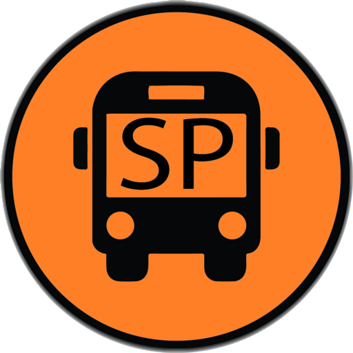
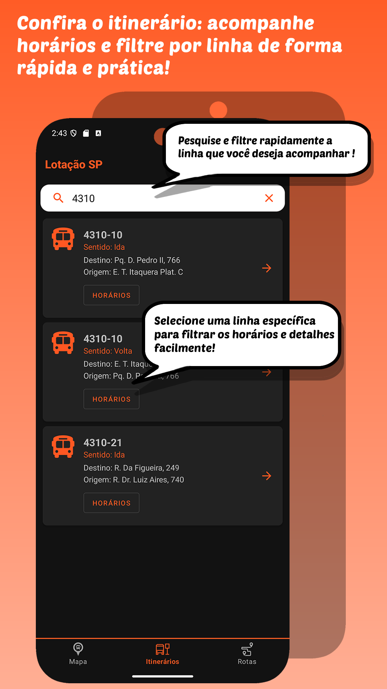
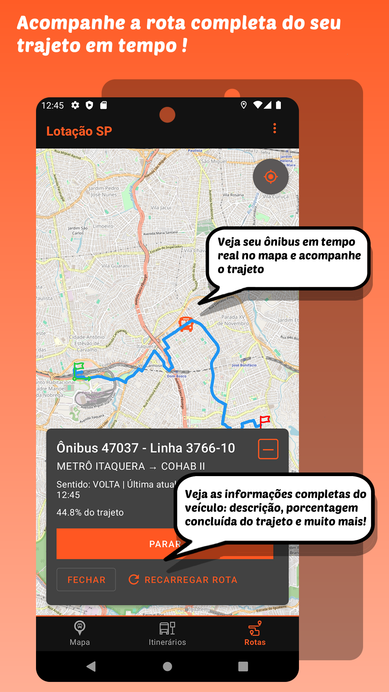
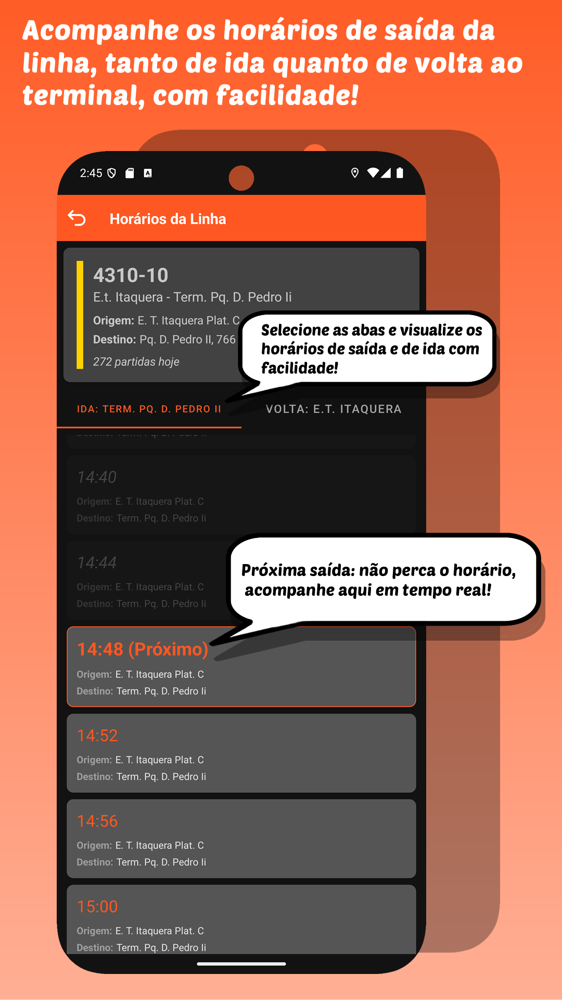
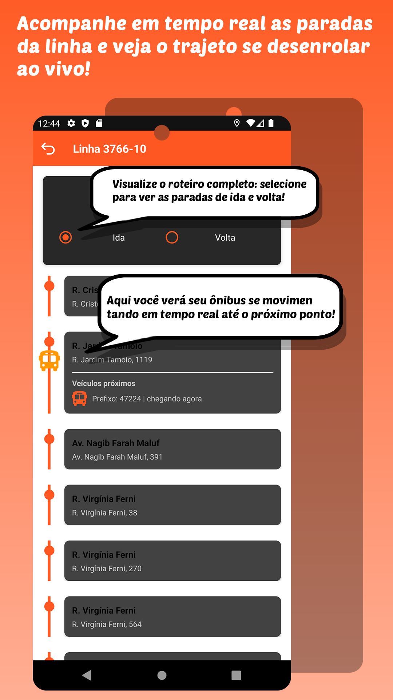

# Lotação SP

  

## 📱 Sobre o Aplicativo

Lotação SP é um aplicativo Android que fornece informações em tempo real sobre a localização dos ônibus na cidade de São Paulo. Utilizando dados oficiais da SPTrans, o aplicativo permite aos usuários acompanhar a posição dos ônibus, verificar horários de chegada e visualizar rotas diretamente no mapa.

O objetivo é facilitar o deslocamento dos paulistanos, reduzindo o tempo de espera nos pontos de ônibus e permitindo um melhor planejamento das viagens.

## 📸 Screenshots

  
  
  
  
  
  

## ✨ Recursos Principais

- **Visualização em Tempo Real:** Veja a posição atual dos ônibus diretamente no mapa
- **Busca por Linhas:** Encontre facilmente a linha que deseja acompanhar
- **Rastreamento de Rotas:** Visualize o trajeto completo das linhas de ônibus
- **Próximas Paradas:** Veja as próximas paradas e o tempo estimado de chegada
- **Notificações:** Receba alertas quando o ônibus estiver se aproximando da sua parada
- **Modo Offline:** Acesse informações básicas mesmo sem conexão com internet
- **Interface Intuitiva:** Design moderno e fácil de usar

## 🛠️ Tecnologias Utilizadas

- **Linguagem:** Kotlin
- **Arquitetura:** MVVM (Model-View-ViewModel)
- **Componentes Android:**
  - ViewModel e LiveData
  - Room Database para armazenamento local
  - ViewBinding
- **Integração com APIs:** Conexão com a API oficial da SPTrans
- **Mapas e Geolocalização:** Visualização de ônibus e paradas em tempo real
- **Material Design:** Interface moderna seguindo as diretrizes de design do Google

## 📱 Disponibilidade

O Lotação SP estará disponível em breve para dispositivos Android na Google Play Store.

  

Aguarde o lançamento oficial para ter acesso a todas as funcionalidades do aplicativo!

## 📄 Termos de Uso

O aplicativo Lotação SP é disponibilizado sob nossos [Termos de Serviço](index.html), que definem as condições de uso, políticas de privacidade e limitações de responsabilidade.

## 🔄 Dados

Este aplicativo utiliza dados fornecidos pela SPTrans através de sua API pública. Os dados são atualizados em tempo real e podem estar sujeitos a imprecisões ou atrasos, dependendo da disponibilidade do serviço da SPTrans.

## 📞 Contato

Se você tiver alguma dúvida ou sugestão sobre o Lotação SP, entre em contato através do e-mail: cassiolucianodasilva@gmail.com

---

  Desenvolvido com ❤️ em São Paulo, Brasil

